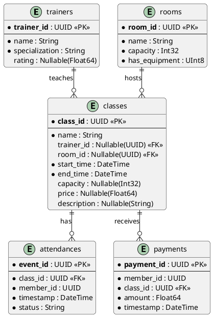

## Entity Relationships

```
trainers (1) ──────< (0..N) classes
rooms (1) ──────< (0..N) classes
classes (1) ──────< (0..N) attendances
classes (1) ──────< (0..N) payments
```
 <!-- (PlantUML) -->


