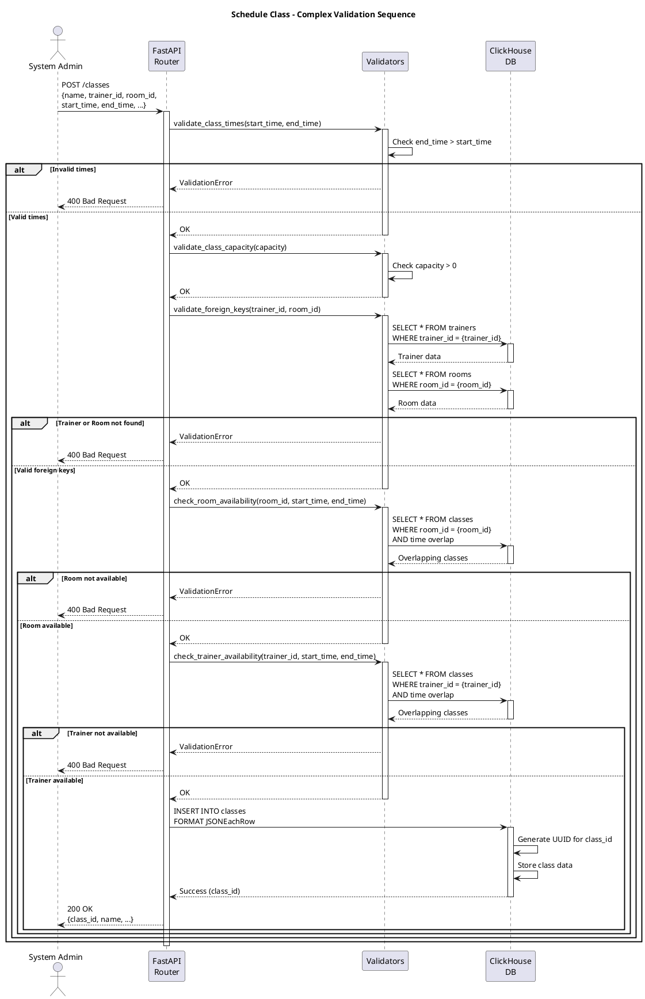

<!-- Schedule Class -->

```plantuml
@startuml
title Schedule Class - Complex Validation Sequence

actor "System Admin" as Admin
participant "FastAPI\nRouter" as Router
participant "Validators" as Validator
participant "ClickHouse\nDB" as DB

Admin -> Router: POST /classes\n{name, trainer_id, room_id,\nstart_time, end_time, ...}
activate Router

Router -> Validator: validate_class_times(start_time, end_time)
activate Validator
Validator -> Validator: Check end_time > start_time
alt Invalid times
    Validator --> Router: ValidationError
    Router --> Admin: 400 Bad Request
else Valid times
    Validator --> Router: OK
    deactivate Validator
    
    Router -> Validator: validate_class_capacity(capacity)
    activate Validator
    Validator -> Validator: Check capacity > 0
    Validator --> Router: OK
    deactivate Validator
    
    Router -> Validator: validate_foreign_keys(trainer_id, room_id)
    activate Validator
    Validator -> DB: SELECT * FROM trainers\nWHERE trainer_id = {trainer_id}
    activate DB
    DB --> Validator: Trainer data
    deactivate DB
    
    Validator -> DB: SELECT * FROM rooms\nWHERE room_id = {room_id}
    activate DB
    DB --> Validator: Room data
    deactivate DB
    
    alt Trainer or Room not found
        Validator --> Router: ValidationError
        Router --> Admin: 400 Bad Request
    else Valid foreign keys
        Validator --> Router: OK
        deactivate Validator
        
        Router -> Validator: check_room_availability(room_id, start_time, end_time)
        activate Validator
        Validator -> DB: SELECT * FROM classes\nWHERE room_id = {room_id}\nAND time overlap
        activate DB
        DB --> Validator: Overlapping classes
        deactivate DB
        
        alt Room not available
            Validator --> Router: ValidationError
            Router --> Admin: 400 Bad Request
        else Room available
            Validator --> Router: OK
            deactivate Validator
            
            Router -> Validator: check_trainer_availability(trainer_id, start_time, end_time)
            activate Validator
            Validator -> DB: SELECT * FROM classes\nWHERE trainer_id = {trainer_id}\nAND time overlap
            activate DB
            DB --> Validator: Overlapping classes
            deactivate DB
            
            alt Trainer not available
                Validator --> Router: ValidationError
                Router --> Admin: 400 Bad Request
            else Trainer available
                Validator --> Router: OK
                deactivate Validator
                
                Router -> DB: INSERT INTO classes\nFORMAT JSONEachRow
                activate DB
                DB -> DB: Generate UUID for class_id
                DB -> DB: Store class data
                DB --> Router: Success (class_id)
                deactivate DB
                
                Router --> Admin: 200 OK\n{class_id, name, ...}
            end
        end
    end
end

deactivate Router

@enduml
```