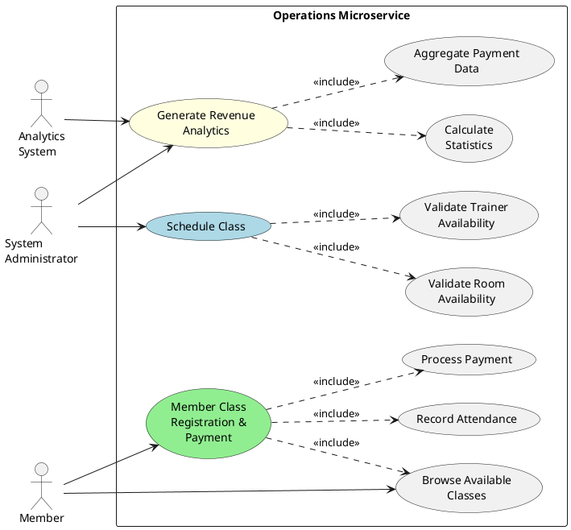

```plantuml
@startuml
left to right direction
skinparam packageStyle rectangle

actor "System\nAdministrator" as Admin
actor "Member" as Member
actor "Analytics\nSystem" as Analytics

rectangle "Operations Microservice" {
  
  usecase "Schedule Class" as UC1 #LightBlue
  usecase "Member Class\nRegistration &\nPayment" as UC2 #LightGreen
  usecase "Generate Revenue\nAnalytics" as UC3 #LightYellow
  
  usecase "Validate Trainer\nAvailability" as UC4
  usecase "Validate Room\nAvailability" as UC5
  usecase "Browse Available\nClasses" as UC6
  usecase "Process Payment" as UC7
  usecase "Record Attendance" as UC8
  usecase "Aggregate Payment\nData" as UC9
  usecase "Calculate\nStatistics" as UC10
}

' Actor connections
Admin --> UC1
Member --> UC2
Member --> UC6
Analytics --> UC3
Admin --> UC3

' Include relationships
UC1 ..> UC4 : <<include>>
UC1 ..> UC5 : <<include>>

UC2 ..> UC6 : <<include>>
UC2 ..> UC7 : <<include>>
UC2 ..> UC8 : <<include>>

UC3 ..> UC9 : <<include>>
UC3 ..> UC10 : <<include>>

@enduml
```
